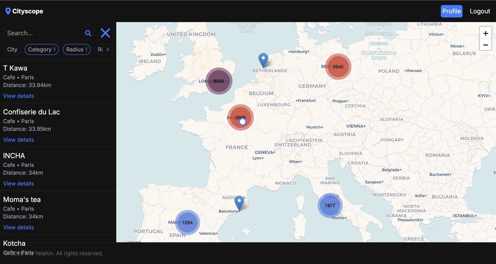
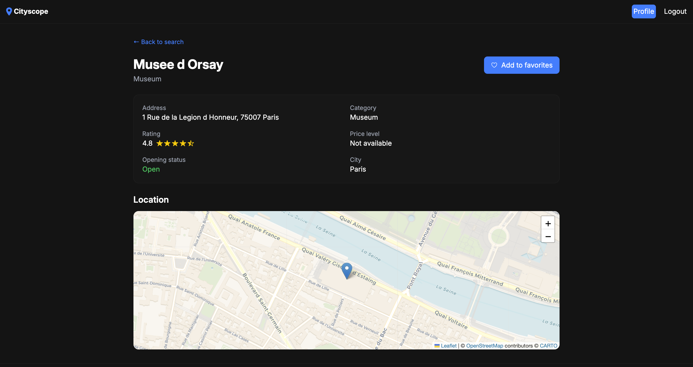
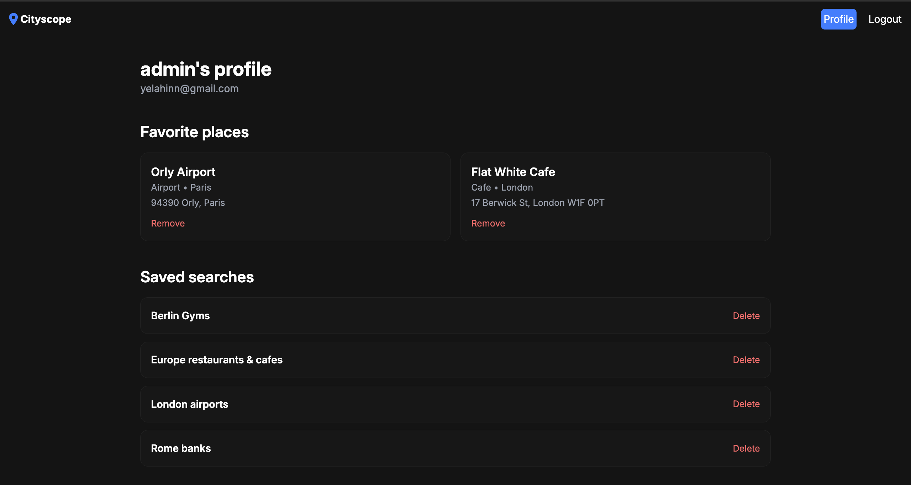

# Cityscope

<hr>

Cityscope is a geo search web app for discovering nearby places 

## Preview





## Installation

<hr>

1) Clone the repository
```bash
git clone https://github.com/Yelahin/cityscope
```

2) Open project folder
```bash
cd cityscope
```

3) Create **backend/.env** file for backend and create **frontend/.env.local** file for frontend

4) Set up variables in **backend/.env** and **frontend/.env.local** file. Variables displayed in **.env.example** file located both in backend and frontend app


**Backend**:
```bash
SECRET_KEY=your-django-secret-key
DJANGO_SETTINGS_MODULE=your-settings-file # For example: cityscope.settings.local or cityscope.settings.production
DJANGO_DEBUG=true-or-false-for-debug-mode
POSTGRES_DB=name-of-your-db
POSTGRES_USER=username-of-your-db
POSTGRES_PASSWORD=password-of-your-db
POSTGRES_HOST=cityscope-postgres
POSTGRES_PORT=5432
OVERPASS_API_ENDPOINT=your-overpass-endpoint # For example: "https://overpass.private.coffee/api/interpreter"
```

**Frontend**:
```bash
NEXT_PUBLIC_API_BASE_URL=your-backend-api-endpoint # For example: "http://localhost:8000/api/"  
```

5) Make sure Docker Engine or Docker Desktop is working

6) Create and run containers in detached mode
```bash
docker compose up --build -d
```

7) Apply database migrations
```bash
docker exec cityscope-backend python manage.py migrate
```

## Architecture Overview

### Tech Stack
- **Backend**: Django
- **REST API**: Django REST Framework
- **Database**: PostgreSQL
- **Background tasks**: Celery & Celery beat
- **Task broker**: Redis
- **Auth**: JWT, `httponly`
- **Frontend**: Next.js, TypeScript
- **Map**: `react-leaflet`

### Project Structure

```
cityscope/
├── backend/
│   ├── cityscope      # project configuration
│   ├── core           # main app with core backend logic
│   ├── docs           # backend documentations
│   ├── fetchdata      # fetch data logic from external sources
│   └── users          # users/authentication logic
└── frontend/
    ├── app/          # core frontend logic
    │   ├── lib          # ui logic
    │   ├── login        # login page
    │   ├── places       # detail page
    │   ├── profile      # profile page
    │   ├── sign-up      # sign up page
    │   └── ui           # shared components and primitives
    └── public/       # icons, images, assets
```

### Pipeline

#### Backend

`cityscope` and `core` configure all **settings**, **databases**, and **dependencies**

`fetchdata` **fetches**, **transforms**, and **saves** data to the database

`users` handles **permissions** and **authentication** logic for the application and its users

#### Frontend

`app` configures all **pages** for the frontend app

`lib` stores core logic for the frontend, connects to the **backend API**

`ui` stores all shared **components** used across the frontend app

### API

API endpoints exist for:
- Places: `/api/places`
- Favorite Places: `/api/places/favorite`
- Saved Searches: `/api/searches`

Detailed information about API endpoints can be found in the `cityscope/backend/docs` folder:

```
cityscope/
└── backend/
    └── docs
```